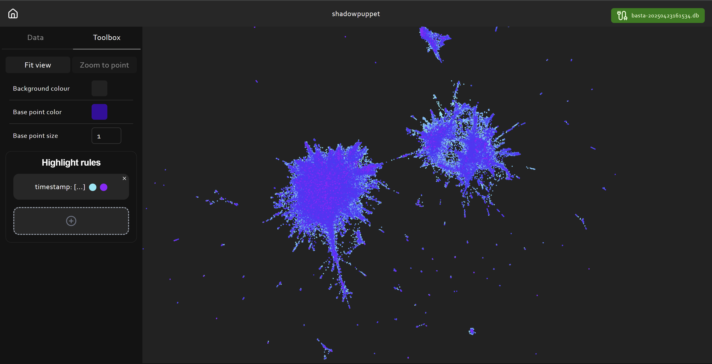

# Shadowpuppet

Shadowpuppet is a GUI tool for visualising semantic scatter plots. Semantic scatter plots represent data with more aligned meaning as points that are closer on a graph. Graphs are produced by representing textual data in a high-dimensional space using sentence embeddings then projecting back down onto a 2d plot using techniques like PaCMAP. This approach results in context-aware visualisations of unstructured datasets. 

Shadowpuppet facilitates graph creation and exploration reading data into a local sqlite database and executing queries to highlight points. Shadowpuppet uses local models and no data leaves your device. 

## Installation

Shadowpuppet is available as x86 Tauri binaries for Windows (NSIS installer) and macOS (.app bundle) under the releases section. Binaries contain the entire application in a single executable file for ease of use. The releases section also contains prebuilt  pyinstaller binaries for Windows (x86) and macOS (aarch64), which start a server on `http://localhost:8000` containing the UI. The application server uses singleton clients and is not suitable to serve multiple clients. 

Shadowpuppet can also be deployed via a Python FastAPI server serving a statically compiled Svelte5 web application. This is the recommended usage for Linux users due to excessive bundle sizes on Linux. The steps for serving the application require `npm` and `pip/python3` and are:

1. install frontend dependencies with `npm install` from `./frontend`
2. build the frontend files with `npm run build` from `./frontend`
3. install server dependencies with `pip install -r requirements.txt` from `./server`, using a virtual environment per preference
4. run the server using `python3 server.py` from `./server`
5. use Shadowpuppet at `http://localhost:8000` 

Shadowpuppet working databases created will be created in a `./databases` directory in the same location the server executable or script runs from. Sentence transformer models are downloaded using the `huggingface-hub` Python library and will use the relevant [cache locations](https://huggingface.co/docs/huggingface_hub/en/guides/manage-cache).